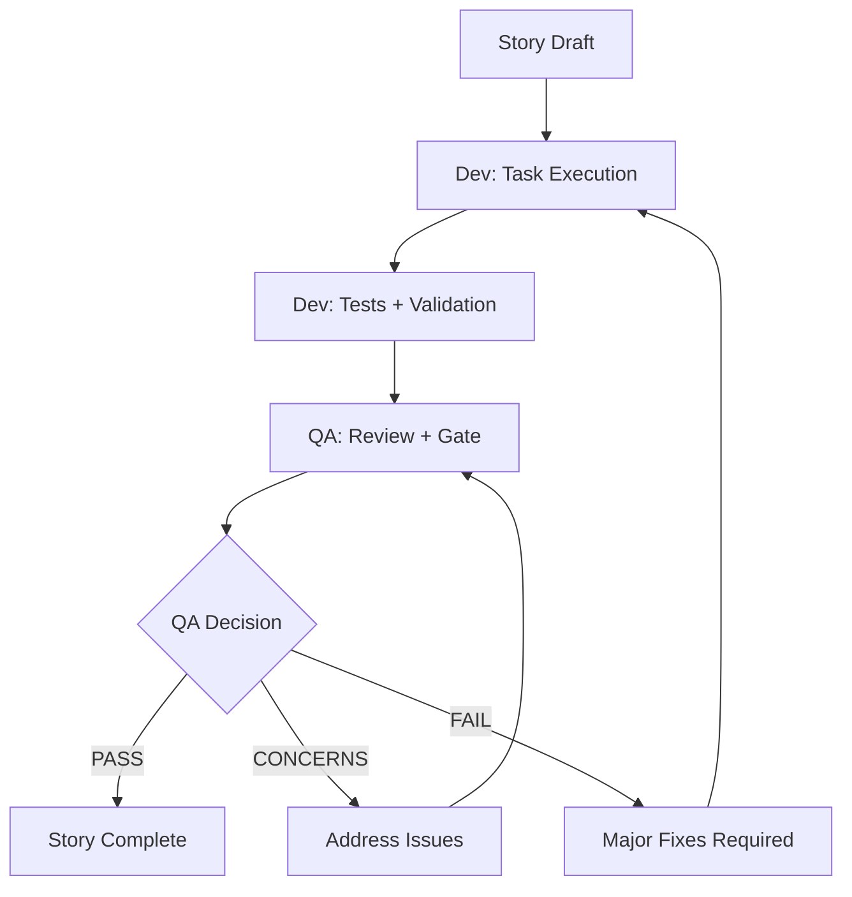

# AgenticLanding AI - BMad Workflow Process

## Overview

This document outlines the structured BMad Method workflow for developing AgenticLanding AI, ensuring systematic planning, development, and delivery of the 6 core modules with enterprise-grade quality and compliance standards.

## BMad Method Integration

### Current Project Status
- **Phase**: Planning/Architecture Design (BMad Phase 1)
- **Framework**: BMad Method fully installed and configured
- **Documentation**: Comprehensive PRD, Architecture, and Epics completed
- **Next Phase**: Document Sharding and Story Creation

### BMad Agent Roles for AgenticLanding AI

#### Primary Planning Agents (Phase 1)
1. **BMad Orchestrator** - Overall workflow guidance and coordination
2. **Product Manager (PM)** - PRD validation, epic/story refinement
3. **Architect** - System architecture, technical specifications
4. **UX Expert** - Frontend specifications, user experience design
5. **QA Specialist** - Risk assessment, test strategy, quality gates

#### Development Agents (Phase 2)
1. **Scrum Master (SM)** - Story drafting, sprint planning
2. **Developer (Dev)** - Implementation, testing, code quality
3. **QA Specialist** - Testing, quality assurance, gate management

## Structured Workflow Process

### Phase 1: Planning and Architecture (Current Phase)

#### Step 1: Document Sharding
**Objective**: Break down comprehensive documentation into manageable, focused documents for development.

**BMad Commands**:
```bash
/BMad:tasks:shard-doc docs/prd.md
/BMad:tasks:shard-doc docs/architecture/system-architecture.md
```

**Expected Outputs**:
- `docs/stories/` - Individual user stories from epics
- `docs/requirements/` - Sharded functional requirements
- `docs/technical/` - Focused technical specifications

#### Step 2: Risk Assessment and Test Strategy
**Objective**: Identify implementation risks and create comprehensive test strategies.

**BMad Commands**:
```bash
/BMad:agents:qa *risk {epic-name}
/BMad:agents:qa *design {epic-name}
```

**Risk Areas for AgenticLanding AI**:
- **AI Integration Complexity**: GPT-4o API reliability and cost management
- **Brand Compliance**: Automated guideline validation accuracy
- **Sitecore Integration**: BYOC compatibility and component standards
- **Performance Requirements**: Sub-2 second page load times
- **Security & Privacy**: GDPR/CCPA compliance implementation

#### Step 3: Architecture Validation
**Objective**: Ensure technical architecture meets enterprise requirements.

**BMad Commands**:
```bash
/BMad:agents:architect validate-tech-stack
/BMad:agents:architect design-apis
/BMad:agents:architect plan-integration
```

**Architecture Focus Areas**:
- Scalability for enterprise usage
- Security for data privacy and compliance
- Performance for global deployment
- Integration flexibility for multiple platforms

### Phase 2: Development Execution

#### Step 4: Story Creation and Validation
**Objective**: Create detailed, actionable stories from epics.

**BMad Commands**:
```bash
/BMad:tasks:create-next-story
/BMad:agents:pm validate-story {story}
/BMad:agents:qa *risk {story}
```

**Story Creation Process**:
1. **SM drafts story** from sharded epic requirements
2. **High-risk stories** get QA risk assessment (*risk)
3. **Optional validation** by PM for story alignment
4. **User approval** before development begins

#### Step 5: Sequential Development Cycle
**Objective**: Implement stories with quality-first approach.

**Development Workflow**:


**Quality Gates**:
- **PASS**: All requirements met, ready for production
- **CONCERNS**: Non-critical issues, team review required
- **FAIL**: Critical issues blocking release

#### Step 6: Continuous Integration and Deployment
**Objective**: Maintain code quality and deployment readiness.

**CI/CD Pipeline**:
1. **Automated Testing** on every commit
2. **Code Quality Checks** (linting, security scanning)
3. **Performance Testing** for key features
4. **Staging Deployment** for user acceptance testing
5. **Production Deployment** with automated rollback

## Module-Specific Workflow Considerations

### Module 1: Data-Driven Generation
**Special Considerations**:
- **AI Model Training**: Historical data analysis accuracy
- **Performance**: Large dataset processing requirements
- **Data Privacy**: Secure handling of campaign data

**QA Focus**:
- Algorithm accuracy validation
- Performance benchmarking
- Data security assessment

### Module 2: Section-by-Section Control
**Special Considerations**:
- **Real-time Updates**: Preview synchronization performance
- **Brand Validation**: Guideline enforcement accuracy
- **User Experience**: Natural language prompt interpretation

**QA Focus**:
- Usability testing
- Brand compliance validation
- Performance under concurrent usage

### Module 3: Auto Form Builder
**Special Considerations**:
- **Compliance**: GDPR/CCPA legal requirements
- **Integration**: CRM API connectivity and reliability
- **Security**: Payment processing and data protection

**QA Focus**:
- Compliance validation
- Integration testing with real CRMs
- Security audit and penetration testing

### Module 4: Template Library
**Special Considerations**:
- **Performance**: Template generation speed
- **Scalability**: Large template library management
- **Collaboration**: Multi-user template editing

**QA Focus**:
- Template generation accuracy
- Performance under load
- Concurrent user testing

### Module 5: Explainability Module
**Special Considerations**:
- **Accuracy**: Decision rationale correctness
- **Transparency**: Clear explanation generation
- **Traceability**: Data source mapping accuracy

**QA Focus**:
- Rationale accuracy validation
- Documentation quality assessment
- Traceability verification

### Module 6: Deployment & Sitecore Integration
**Special Considerations**:
- **Reliability**: 99.9% uptime requirements
- **Integration**: Sitecore BYOC compatibility
- **Security**: SSL certificate management

**QA Focus**:
- Deployment reliability testing
- Sitecore integration validation
- Security compliance verification

## BMad Command Sequences

### Planning Phase Commands
```bash
# Start with orchestrator guidance
/BMad:agents:bmad-orchestrator *help

# Document sharding
/BMad:tasks:shard-doc docs/prd.md
/BMad:tasks:shard-doc docs/architecture/system-architecture.md

# Risk assessment for each epic
/BMad:agents:qa *risk epic-01-data-driven-generation
/BMad:agents:qa *design epic-01-data-driven-generation

# Architecture validation
/BMad:agents:architect validate-tech-stack
/BMad:agents:architect design-apis

# Master checklist
/BMad:agents:po run-master-checklist
```

### Development Phase Commands
```bash
# Story creation
/BMad:tasks:create-next-story

# Development workflow
/BMad:agents:dev implement-story {story-name}

# Quality assurance
/BMad:agents:qa *review {story-name}
/BMad:agents:qa *gate {story-name}

# Continuous improvement
/BMad:agents:qa *nfr {story-name}
/BMad:agents:qa *trace {story-name}
```

## Quality Standards and Metrics

### Development Quality Metrics
- **Code Coverage**: Minimum 90% for critical modules
- **Performance**: Sub-2 second page load times
- **Security**: Zero critical vulnerabilities
- **Accessibility**: WCAG 2.1 AA compliance
- **Documentation**: 100% API documentation coverage

### BMad Process Metrics
- **Story Completion Rate**: Target 95% on-time delivery
- **Quality Gate Pass Rate**: Target 90% first-time pass
- **Defect Density**: <1 defect per 1000 lines of code
- **User Satisfaction**: 4.5+ star rating for delivered features

## Risk Management

### High-Priority Risks
1. **AI Service Reliability**: GPT-4o API availability and cost management
2. **Brand Compliance Accuracy**: Automated validation correctness
3. **Integration Complexity**: Sitecore and CRM integration challenges
4. **Performance at Scale**: Enterprise usage performance requirements

### Mitigation Strategies
1. **AI Service**: Multiple provider fallbacks, cost monitoring
2. **Brand Compliance**: Manual validation overrides, regular updates
3. **Integration**: Comprehensive testing, vendor partnerships
4. **Performance**: Load testing, scalable architecture design

## Success Criteria

### Planning Phase Success
- [ ] All documents sharded and organized
- [ ] Risk assessments completed for all epics
- [ ] Architecture validated against requirements
- [ ] Quality gates established and approved

### Development Phase Success
- [ ] All stories completed with quality gates passed
- [ ] Performance benchmarks achieved
- [ ] Security and compliance requirements satisfied
- [ ] User acceptance testing completed successfully

### Overall Project Success
- [ ] 6 core modules fully functional
- [ ] Enterprise-grade quality and security
- [ ] Sitecore BYOC compatibility verified
- [ ] Customer acceptance and deployment readiness

## Next Steps

1. **Execute BMad Orchestrator**: Begin workflow guidance
2. **Complete Document Sharding**: Break down epics into stories
3. **Conduct Risk Assessments**: Identify and mitigate implementation risks
4. **Validate Architecture**: Ensure technical readiness
5. **Begin Development Cycles**: Start systematic story implementation

This structured BMad workflow ensures AgenticLanding AI is developed with enterprise-grade quality, comprehensive testing, and systematic risk management throughout the entire development lifecycle.