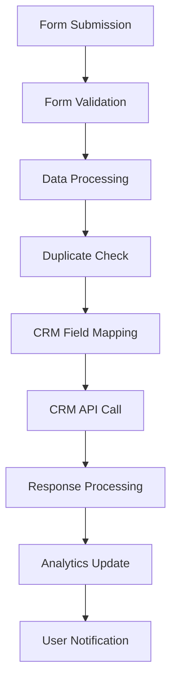

# Epic 3: Auto Form Builder Module

## Epic Overview

Create an intelligent form generation system that automatically recommends and builds optimized lead capture forms based on campaign goals, industry best practices, and compliance requirements. This module includes dynamic form creation, API endpoint generation, and built-in compliance features.

## Business Value

- **40% increase** in form completion rates through intelligent optimization
- **100% compliance** with GDPR/CCPA requirements
- **Zero development effort** for form creation and API integration

## Epic Definition

**Objective**: Build an automated form generation system that creates campaign-appropriate forms with API endpoints, compliance features, and optimization based on conversion best practices.

**Success Criteria**:
- Generate optimized forms for all campaign types (lead-gen, sales, signup)
- Auto-create RESTful API endpoints for form submissions
- Ensure 100% GDPR/CCPA compliance
- Provide form analytics and optimization suggestions

## User Stories

### Story 3.1: Campaign-Based Form Recommendation
**As a** marketer, **I want to** receive intelligent form field recommendations based on my campaign type, **so that** I can maximize conversion rates without guessing what fields to include.

**Acceptance Criteria**:
- Analyze campaign type and suggest optimal form fields
- Provide industry-specific field recommendations
- Show conversion probability for each recommended field
- Allow field additions/removals with impact predictions
- Support custom field creation with validation

**Campaign Type Templates**:
- **Lead Generation**: Name, Email, Company, Phone (optional), Budget Range
- **Sales Demo**: Name, Email, Company, Job Title, Team Size, Timeline
- **Newsletter Signup**: Name, Email, Interests (optional)
- **Free Trial**: Name, Email, Company, Password, Phone (optional)

### Story 3.2: Dynamic Form Field Builder
**As a** marketer, **I want to** build forms with various field types and validation rules, **so that** I can collect the exact information I need while ensuring data quality.

**Acceptance Criteria**:
- Support 15+ field types (text, email, phone, dropdown, checkbox, etc.)
- Configure validation rules for each field
- Set up conditional logic for field visibility
- Create custom field labels and help text
- Preview form behavior in real-time

**Field Types Support**:
- Text Input (single-line, multi-line)
- Email, Phone, URL inputs
- Number inputs with range validation
- Date/Time pickers
- Dropdown selects (single/multiple)
- Radio buttons and checkboxes
- File uploads with size limits
- Rating scales and NPS

### Story 3.3: RESTful API Endpoint Generation
**As a** marketer, **I want to** automatically generate API endpoints for form submissions, **so that** I can integrate with my CRM and marketing tools without developer assistance.

**Acceptance Criteria**:
- Generate unique API endpoints for each form
- Support multiple authentication methods (API key, JWT)
- Provide webhook endpoints for real-time notifications
- Create data mapping for CRM integration
- Include rate limiting and abuse protection

**API Features**:
- POST endpoints for form submissions
- GET endpoints for submission retrieval
- Webhook support for real-time integrations
- Data validation and sanitization
- Error handling and status codes

### Story 3.4: CRM/Marketing Automation Integration
**As a** marketer, **I want to** connect forms to my existing CRM and marketing tools, **so that** leads flow automatically into my sales pipeline.

**Acceptance Criteria**:
- Pre-built integrations for major CRMs (Salesforce, HubSpot, Marketo)
- Custom field mapping between forms and CRM fields
- Data sync status monitoring and error handling
- Duplicate lead detection and management
- Historical data import capabilities

**Supported Integrations**:
- **Salesforce**: Lead, Contact, Account object creation
- **HubSpot**: Contacts, Deals, Companies
- **Marketo**: Leads, Opportunities
- **Mailchimp**: Subscriber list management
- **Zapier**: 3000+ app connections

### Story 3.5: GDPR/CCPA Compliance Automation
**As a** marketer, **I want to** ensure all forms comply with privacy regulations, **so that** I avoid legal issues and maintain customer trust.

**Acceptance Criteria**:
- Auto-add consent checkboxes for data processing
- Include privacy policy links and terms acceptance
- Implement data retention policies
- Provide data subject rights fulfillment
- Generate compliance documentation

**Compliance Features**:
- GDPR consent management (explicit consent required)
- CCPA "Do Not Sell" options
- Data processing transparency
- Right to access/delete implementation
- Cookie and tracking disclosure

### Story 3.6: Form Analytics and Optimization
**As a** marketer, **I want to** analyze form performance and receive optimization suggestions, **so that** I can continuously improve conversion rates.

**Acceptance Criteria**:
- Track form views, starts, completions, and abandonment
- Identify drop-off points in form funnels
- A/B test different form layouts and field orders
- Provide conversion optimization recommendations
- Generate performance reports with insights

**Analytics Metrics**:
- Form view count and unique visitors
- Form start rate (views to starts)
- Field-by-field completion rates
- Overall conversion rate
- Time to complete forms
- Device and source breakdown

### Story 3.7: Advanced Form Features
**As a** marketer, **I want to** access advanced form features for specific use cases, **so that** I can handle complex data collection scenarios.

**Acceptance Criteria**:
- Multi-step forms with progress indicators
- File upload capabilities with virus scanning
- Payment processing integration
- Appointment scheduling forms
- Conditional logic based on user responses

**Advanced Features**:
- Progress bars and step indicators
- File type and size validation
- Stripe/PayPal payment integration
- Calendar booking with availability
- Dynamic field show/hide logic

## Technical Architecture

### Form Configuration Schema
```typescript
interface FormConfiguration {
  id: string;
  name: string;
  campaignType: 'lead-gen' | 'sales' | 'signup';
  fields: FormField[];
  validation: ValidationRules;
  styling: FormStyling;
  integrations: IntegrationConfig[];
  compliance: ComplianceConfig;
  analytics: AnalyticsConfig;
}

interface FormField {
  id: string;
  type: FieldType;
  label: string;
  placeholder?: string;
  required: boolean;
  validation: FieldValidation;
  conditional?: ConditionalLogic;
  styling: FieldStyling;
}
```

### API Generation System
```typescript
class FormAPIGenerator {
  generateEndpoint(formConfig: FormConfiguration): APIEndpoint;
  createWebhookHandler(formId: string): WebhookHandler;
  setupAuthentication(endpoint: APIEndpoint, authType: AuthType): void;
  implementRateLimiting(endpoint: APIEndpoint): void;
  generateDocumentation(api: APIEndpoint): APIDocumentation;
}
```

### Compliance Engine
```typescript
class ComplianceEngine {
  validateGDPR(form: FormConfiguration): GDPRValidation;
  addConsentFields(form: FormConfiguration): FormConfiguration;
  generatePrivacyPolicyLinks(consentType: ConsentType): PrivacyLink[];
  implementDataRetention(form: FormConfiguration, retentionPolicy: RetentionPolicy): void;
}
```

## Integration Architecture

### CRM Integration Flow


### Webhook System
```typescript
interface WebhookConfig {
  url: string;
  events: WebhookEvent[];
  authentication: WebhookAuth;
  retryPolicy: RetryPolicy;
  headers: Record<string, string>;
}

class WebhookManager {
  registerWebhook(formId: string, config: WebhookConfig): void;
  triggerWebhook(event: WebhookEvent, data: FormSubmission): void;
  handleWebhookResponse(response: WebhookResponse): void;
  retryFailedWebhooks(): void;
}
```

## Dependencies

**Internal Dependencies**:
- User authentication system
- Analytics tracking infrastructure
- Database for form submissions
- Email notification system

**External Dependencies**:
- CRM API integrations (Salesforce, HubSpot, etc.)
- Payment processing APIs (Stripe, PayPal)
- File storage services (AWS S3)
- Email delivery services (SendGrid, Mailgun)

## Risk Assessment

**High Risk**:
- CRM API integration complexity and reliability
- GDPR/CCPA compliance accuracy
- Payment processing security requirements

**Medium Risk**:
- Form validation and data quality
- Webhook reliability and error handling
- Performance with high submission volumes

**Mitigation Strategies**:
- Comprehensive CRM integration testing
- Legal review of compliance features
- Security audit for payment processing
- Robust error handling and retry mechanisms

## Acceptance Tests

### Functional Tests
- [ ] Generate optimized forms for all campaign types
- [ ] Create functional API endpoints for form submissions
- [ ] Validate compliance features for all regions
- [ ] Test CRM integrations with real data

### Security Tests
- [ ] Validate input sanitization and XSS protection
- [ ] Test CSRF protection mechanisms
- [ ] Verify data encryption at rest and in transit
- [ ] Audit payment processing security

### Performance Tests
- [ ] Handle 1000+ form submissions per minute
- [ ] Process webhook deliveries within 5 seconds
- [ ] Support 100+ concurrent form views

## Definition of Done

- [ ] All form types implemented with optimization recommendations
- [ ] API endpoints functional with proper authentication
- [ ] GDPR/CCPA compliance features validated by legal review
- [ ] CRM integrations tested and documented
- [ ] Analytics dashboard functional with insights
- [ ] Security audit completed and issues resolved
- [ ] Performance benchmarks achieved

## Success Metrics

- **Form Conversion Rate**: 40%+ improvement over industry average
- **API Reliability**: 99.9% uptime for form submission endpoints
- **Integration Success**: 95%+ successful CRM data sync
- **Compliance Score**: 100% GDPR/CCPA requirement fulfillment

## Technical Debt and Future Considerations

**Planned Enhancements**:
- AI-powered form field optimization
- Advanced fraud detection and prevention
- Multi-language form support
- Progressive profiling capabilities

**Technical Debt Tracking**:
- Optimize form rendering performance
- Enhance webhook error handling
- Improve mobile form experience
- Expand CRM integration library

---

**Epic Owner**: Product Manager
**Tech Lead**: Backend Developer
**QA Lead**: Quality Assurance Engineer
**Estimated Duration**: 10-12 weeks
**Complexity**: High
**Priority**: Critical