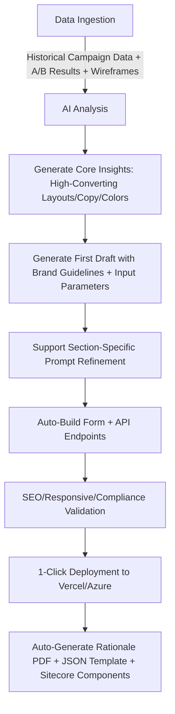

# III. Technical Design

## 1. Tech Stack Selection (Balancing Development Efficiency & Competition Requirements)

| Module         | Tech Stack                                                                 |
|----------------|----------------------------------------------------------------------------|
| Frontend       | React 18 + Next.js 14 (SSR/SSG for SEO, native Vercel support), Tailwind CSS (rapid brand style adaptation), Framer Motion (lightweight animations for UX) |
| Backend        | Node.js + Express (lightweight API service), MongoDB (stores templates/data insights/user configurations) |
| AI Core        | GPT-4o (content generation + decision reasoning), LangChain (Agentic workflow orchestration), Pandas (historical data statistical analysis) |
| 3rd-Party Integrations | Vercel API (deployment), Azure SDK (alternative deployment), DocuPDF (PDF generation), GA/GTM API (analytics configuration), Sitecore Component SDK (BYOC adaptation) |
| Data Security  | JWT authentication, encrypted storage for sensitive data (e.g., API keys), GDPR-compliant data processing workflows |

## 2. Modular Architecture Design (Sitecore BYOC Compatible)

- Core Architecture: Agentic closed loop of "Input Layer → AI Analysis Layer → Generation Layer → Optimization Layer → Deployment Layer → Output Layer"
  1. Input Layer: Accepts JSON configurations (all competition-required Input Parameters), historical data CSVs, and brand assets (logos/fonts/colors).
  2. AI Analysis Layer: Delivers data insights (extracting high-conversion elements) + brand compliance checks (auto-matching DIFC brand guidelines).
  3. Generation Layer: Generates React components (Hero/Form/FAQ, etc.), page layout HTML/CSS, and form APIs by module.
  4. Optimization Layer: Auto-optimizes SEO (title tags, meta descriptions, image ALT text) and responsive design (auto-adjusts layouts for mobile/desktop).
  5. Deployment Layer: Triggers one-click deployment to Vercel/Azure and syncs Sitecore-compatible components.
  6. Output Layer: Delivers live landing page URL, Rationale PDF, JSON template, and component package.
- Component Design: All UI components follow the "atomic design pattern," split into atoms (buttons/inputs), molecules (form groups/cards), and organisms (Hero section/FAQ lists) to support Sitecore drag-and-drop editing.

## 3. Agentic Workflow Automation Logic

