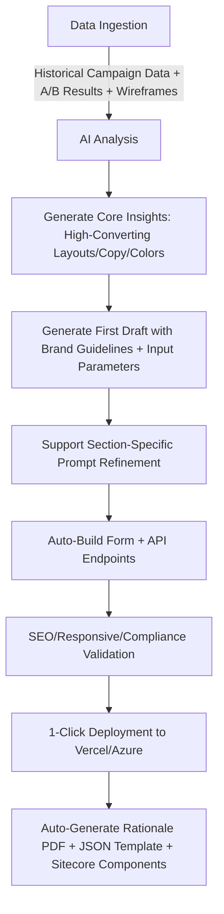

### I. Project Overview: AgenticLanding AI — Full-Automatic Brand-Compliant Landing Page Generation Platform
**Core Positioning**: An end-to-end Agentic AI workflow that transforms campaign context, historical data, and brand guidelines into SEO-optimized, responsive, and Sitecore-compatible landing pages. Every design decision is data-driven, supporting one-click deployment and modular reuse.
**Core Value**: Empowers marketers to quickly generate high-converting landing pages through configurable inputs—no technical/design expertise required. Meets enterprise-level brand compliance and technical integration needs while providing data backing for every design choice.

---

### II. Core Function Design (1:1 Alignment with Competition Core Capabilities)
#### 1. Data-Driven Generation Module
- Multi-source data ingestion: Automatically syncs historical campaign data (traffic, conversions, CAC, etc.), A/B test results, and marketer wireframes (supports Figma/FigJam imports or manual uploads).
- Intelligent analysis engine: Identifies high-conversion key elements (e.g., top-performing layouts, CTA copy, color schemes) and generates data insight reports (e.g., "In the last 3 lead gen campaigns, left-text-right-image layouts achieved 18% higher conversion rates than right-text-left-image").
- Auto-content generation: Creates headlines, subheadlines, body copy, FAQs, etc., based on input parameters (UVP, selling points, audience pain points) and brand tone, while embedding target SEO keywords.

#### 2. Section-by-Section Control Module
- Visual section management: Splits landing pages into 7 core modules—Hero Section, Value Proposition, Features, Testimonials, FAQ, Form Section, and CTA Section.
- Targeted Prompt interaction: Supports directional instructions for individual modules (e.g., "Change Hero button color to brand secondary color and emphasize 'limited-time discount' in copy" or "Restructure FAQ section into 'question + concise answer' format") without affecting other areas.
- Real-time preview sync: Instantly refreshes previews after modifications, supporting simultaneous mobile/desktop view.

#### 3. Auto Form Builder Module
- Dynamic form generation: Automatically recommends form fields based on campaign goals (lead gen/sales)—e.g., lead gen defaults to "Name + Email + Company," while sales adds "Budget Range." Supports custom field types (input/dropdown/radio).
- API-ready endpoint configuration: Auto-generates RESTful API interfaces for direct integration with CRMs (e.g., Salesforce) and marketing automation tools (e.g., HubSpot), with configurable data sync frequency.
- Compliance auto-adaptation: Embeds GDPR/CCPA consent text, links to privacy policy URLs, and binds "accept terms" logic to form submission buttons by default.

#### 4. Template Library Module
- Structured template output: Generates JSON/schematic templates containing full configurations (layout structure, component mapping, brand parameters, SEO settings) for one-click import and reuse.
- Categorized management: Auto-classifies templates by campaign type (lead gen/sales/signup), industry, and layout preference (scrolling/modular/storytelling) for quick retrieval.
- Template iteration: Supports "intelligent optimization" of existing templates using new campaign data to update high-conversion elements.

#### 5. Explainability Module (AI Rationale PDF Generation)
- Full-cycle decision mapping: The PDF automatically includes a complete "data source → analysis conclusion → design choice" link. Examples:
  - Layout choice: "Adopted Hero + Features section structure because historical data shows 'modular layouts' drive 22% longer average time on page in B2B campaigns (Reference Campaign ID: DIFC-2024-Q1-003)."
  - Color choice: "Primary button uses #0066CC (DIFC brand primary color) as A/B test results show 15% higher click-through rates than competitor colors (Reference Experiment ID: AB-2024-042)."
- Compliance & SEO explanation: Dedicated sections for privacy policy embedding logic and SEO keyword placement strategies (e.g., core keywords in H1 tags, image ALT text optimization).

#### 6. One-Click Deployment & Sitecore Integration Module
- Dual-platform deployment: Supports 1-click publishing to Vercel (default, optimized for Next.js) or Azure (App Service/Static Web Apps). Auto-configures SSL certificates and CDN.
- Sitecore BYOC compatibility: Exports modular React/Web components (compliant with Sitecore Component SDK standards) for drag-and-drop integration, including component metadata (name, description, use cases).
- Analytics auto-integration: Embeds GA/GTM IDs during deployment and configures preset event tracking (page load, scroll depth, CTA clicks, form submissions).

---

### III. Technical Design
#### 1. Tech Stack Selection (Balancing Development Efficiency & Competition Requirements)
| Module         | Tech Stack                                                                 |
|----------------|----------------------------------------------------------------------------|
| Frontend       | React 18 + Next.js 14 (SSR/SSG for SEO, native Vercel support), Tailwind CSS (rapid brand style adaptation), Framer Motion (lightweight animations for UX) |
| Backend        | Node.js + Express (lightweight API service), MongoDB (stores templates/data insights/user configurations) |
| AI Core        | GPT-4o (content generation + decision reasoning), LangChain (Agentic workflow orchestration), Pandas (historical data statistical analysis) |
| 3rd-Party Integrations | Vercel API (deployment), Azure SDK (alternative deployment), DocuPDF (PDF generation), GA/GTM API (analytics configuration), Sitecore Component SDK (BYOC adaptation) |
| Data Security  | JWT authentication, encrypted storage for sensitive data (e.g., API keys), GDPR-compliant data processing workflows |

#### 2. Modular Architecture Design (Sitecore BYOC Compatible)
- Core Architecture: Agentic closed loop of "Input Layer → AI Analysis Layer → Generation Layer → Optimization Layer → Deployment Layer → Output Layer"
  1. Input Layer: Accepts JSON configurations (all competition-required Input Parameters), historical data CSVs, and brand assets (logos/fonts/colors).
  2. AI Analysis Layer: Delivers data insights (extracting high-conversion elements) + brand compliance checks (auto-matching DIFC brand guidelines).
  3. Generation Layer: Generates React components (Hero/Form/FAQ, etc.), page layout HTML/CSS, and form APIs by module.
  4. Optimization Layer: Auto-optimizes SEO (title tags, meta descriptions, image ALT text) and responsive design (auto-adjusts layouts for mobile/desktop).
  5. Deployment Layer: Triggers one-click deployment to Vercel/Azure and syncs Sitecore-compatible components.
  6. Output Layer: Delivers live landing page URL, Rationale PDF, JSON template, and component package.
- Component Design: All UI components follow the "atomic design pattern," split into atoms (buttons/inputs), molecules (form groups/cards), and organisms (Hero section/FAQ lists) to support Sitecore drag-and-drop editing.

#### 3. Agentic Workflow Automation Logic

---

### IV. Key Differentiators (Aligned with Competition Evaluation Criteria)
#### 1. Deep Conversion Strategy Alignment
- Auto-recommends "conversion-optimized paths" based on historical campaign data. Example: Lead gen pages default to placing forms below the fold (data shows 23% higher completion rates than above the fold) and emphasize trust signals (client logos + certification badges).
- Intelligent CTA optimization: Adjusts button copy (e.g., "Limited-Time Application") and colors (high-contrast brand colors) automatically based on "emotional triggers" (e.g., urgency) to boost click intent.

#### 2. Transparent Model Reasoning
- Rationale PDF includes "data source → decision logic → performance prediction." Example: "Storytelling layout selected because historical data shows 2:15 average time on page for 'industry solution campaigns' (vs. 1:08 for modular layouts), and target audience (enterprise decision-makers) prefers scenario-based narratives."
- Supports "reverse tracing": Click any page element (e.g., Hero image) to view the rationale in the PDF (e.g., "Based on the image dataset, 'abstract data visualizations' drive 17% higher click-through rates than real-world images in tech campaigns").

#### 3. Enterprise-Grade Technical Quality
- Code standards: Follows React best practices with high-cohesion, low-coupling components. Supports Tree Shaking to optimize load speed (target: first contentful paint ≤ 2 seconds).
- Accessibility compliance: Automatically meets WCAG 2.1 AA standards (e.g., color contrast, screen reader compatibility). SEO optimization includes Schema.org structured data and automatic keyword density control (2%-3%).
- Seamless Sitecore integration: Exported components include "field mapping configurations" for direct import into Sitecore Content Hub, supporting drag-and-drop page building without additional development.

#### 4. Zero-Deviation Brand Compliance
- Built-in DIFC brand guideline validation engine: Automatically detects and corrects non-compliant colors (Hex code matching), fonts (brand-specified typefaces), and logo usage (size/spacing). Rationale for corrections is included in the PDF.
- Real-time copy tone calibration: Filters colloquial expressions based on "Tone of Voice" input (e.g., formal) to ensure alignment with DIFC’s brand voice.

---

### V. Deliverables Checklist (100% Compliance with Competition Requirements)
| Deliverable                | Core Content                                                                 |
|-----------------------------|------------------------------------------------------------------------------|
| GitHub Repository           | Frontend code (React+Next.js), backend API service, AI workflow logic, deployment scripts, user manual, data processing scripts |
| Live URL                    | Fully functional landing page deployed on Vercel (includes form submission testing and analytics tracking) |
| 5-Minute Demo Video         | Walkthrough: Input parameter configuration → AI generation → section-specific optimization → deployment → PDF export → Sitecore component import |
| AI-Generated Rationale PDF  | 8-10 page detailed report covering design decisions, data backing, and performance predictions for each module |
| Input Form Template (JSON)  | Reusable template with all competition-required Input Parameters, supporting one-click filling and modification |
| Data Usage Summary          | Lists used historical campaign fields (e.g., conversion rate, CTA clicks), A/B test dimensions (e.g., layout/copy), and data mapping rules |

---

### VI. Final Deliverable Proposal
Would you like me to refine and generate a **detailed technical architecture diagram** (including component hierarchy and API documentation), **Agentic workflow flowchart** (ready for Pitch Deck), **sample Input Template JSON** (populated with DIFC demo data), and **Rationale PDF outline template** to help you quickly compile a complete submission package?